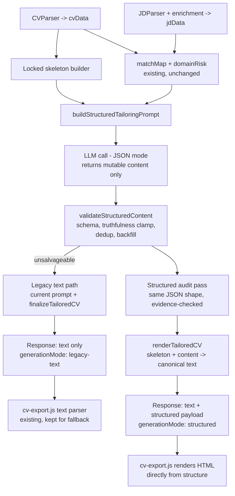

# Structured CV Generation — Design

**Status:** Proposed (awaiting approval)
**Author:** AI solutions architect session, 2026-07-10
**Replaces:** free-text CV rewrite + deterministic text-repair pipeline (kept as fallback)

## 1. Problem

The Tailored CV workflow asks one LLM call to rewrite the user's **entire CV as
free-form text**, then runs ~20 deterministic passes (`finalizeTailoredCV`) to
reverse-engineer and repair the structure, and finally the extension's export
page (`cv-export.js`) **re-parses that text a third time** into HTML.

Every value the model was never supposed to change — company names, dates, job
titles, section headers, section order — round-trips through free text twice.
The model re-emits them in a slightly different shape on every run, and each
shape variation defeats a different assumption in the repair/rendering layers.

Defects observed across live generations of the *same* CV (each one fixed, each
followed by a new variant):

| Defect | Mechanism |
|---|---|
| Date range split across lines ("Feb 2024 -" / "Jun 2025") | Model copied two-column PDF extraction artifacts |
| Company line missing/displaced for one role | Model omitted blank line between entries; entry detection missed the boundary |
| Focus line deleted or stranded under EDUCATION | Entry-boundary detection missed composite/suffixed titles |
| Company line duplicated; title rendered as a company header | Interaction between model output shape and a repair fallback |
| "EDUCATION / CERTIFICATIONS" parsed as an experience entry (BSc line rendered as dates, CKA as job title) | ALL-CAPS header heuristic rejects lines containing `/` |
| Trailing bullets cut mid-word | Token-budget truncation of a full-CV rewrite |
| "Terraform" + "IaC using Terraform" both listed | Competency dedup is exact-match, JD phrases never collapse into tool tokens |

The pattern is structural: **deterministic regex repair of nondeterministic
free text cannot converge.** Worse, repair passes now interact with each other
and with new output shapes, producing corruption of their own.

## 2. Design principle

> The model must only ever produce the content it is allowed to change.
> Everything it must not change is never given to it to re-emit.

Locked facts (companies, dates, titles, education, contacts, section order)
come from `cvData` and are rendered by a deterministic template. The model
returns a small JSON document containing only the mutable content. Malformed
dates, duplicated companies, misplaced Focus lines, and scrambled sections
become *structurally impossible* rather than *repaired*.

## 3. Architecture



Unchanged and reused as-is: CV/JD parsing, LLM JD enrichment, matchMap +
embedding retrieval, domain risk classifier, recruiter review, warnings
validators, ATS keyword coverage, model router, rate limiting, auth.

## 4. The contract

### 4.1 Locked skeleton (built from cvData, never sent for rewriting)

```js
{
  name: cvData.name,
  headline: jdData.jobTitle,               // target-role headline (existing rule)
  contacts: cvData.contacts,               // rendered verbatim
  roles: cvData.experience.map((exp, i) => ({
    id: `role_${i}`,
    company: exp.company,                  // LOCKED verbatim
    dates: exp.dates,                      // LOCKED verbatim
    title: exp.title,                      // LOCKED verbatim
    originalBullets: exp.responsibilities, // grounding + backfill source
  })),
  education: cvData.educationLines,        // LOCKED verbatim, model never sees a reason to touch it
}
```

### 4.2 Mutable content (the ONLY thing the model returns)

```json
{
  "summary": "3-4 line professional summary",
  "competencies": [
    { "label": "Cloud Platform Operations", "items": ["AWS", "GCP", "Azure"] }
  ],
  "roles": [
    { "id": "role_0", "focus": "one line or null", "bullets": ["...", "..."] }
  ]
}
```

Prompt constraints (enforced again by the validator, never trusted):

- `roles[*].id` must match skeleton ids; every skeleton role must appear.
- Bullets must be grounded in that role's `originalBullets` and the supported
  requirements from matchMap (same truthfulness rules as today's prompt).
- Competency items are short noun phrases (tools, skills), never requirement
  sentences ("IaC using Terraform", "deep building systems-of-systems in AWS"
  are explicitly forbidden shapes).
- No employers, dates, titles, credentials, or section headers anywhere in the
  output.

### 4.3 JSON reliability

- `response_format: { type: "json_object" }` on providers that support it
  (Groq does; set per-model on OpenRouter fallbacks where supported).
- Defensive parse regardless: strip code fences, extract first `{` … last `}`.
- Anything unparseable or empty after salvage → **legacy text path for that
  request** (logged, and reported as `generationMode: "legacy-text"`).

## 5. Validation layer (`validateStructuredContent`)

Deterministic, array-based — replaces regex text repair with list operations:

1. **Schema**: required keys, types, role-id coverage. Missing role → filled
   from `originalBullets` untouched (a role can never disappear).
2. **Truthfulness clamp**: competency items filtered against the existing
   allowed-phrase machinery (matchMap `allowedToMention` + confirmedSkills +
   CV-derived skills) — reuses `cleanSkillsSection` internals on arrays.
3. **Competency normalization** (fixes Terraform-twice class):
   - exact dedup on normalized text;
   - containment dedup: drop any item whose tokens include an already-listed
     tool/skill token ("IaC using Terraform" collapses into "Terraform");
   - shape gate: drop items containing requirement-prose markers
     (" using ", " with ", "experience", "deep ", "proficiency", > 6 words).
4. **Bullet hygiene per role**: near-duplicate dedup (existing
   `_normaliseBulletForSimilarity`), min/max bullet count with backfill from
   `originalBullets` (replaces `ensureExperienceDepth` — trivially correct on
   arrays), dangling-fragment trim.
5. **Size clamps**: focus ≤ 140 chars, summary ≤ 600 chars, items ≤ 48 chars.

## 6. Structured audit pass

Today the audit LLM **rewrites the whole CV text** (the single biggest
truncation/corruption risk). Instead it receives the content JSON + per-role
evidence and returns the *same JSON shape* with unsupported claims removed.
Validation re-runs on its output; `finish_reason === "length"` or invalid JSON
→ keep the pre-audit content (same safety semantics as today, far smaller
token budget, structurally incapable of corrupting the skeleton).

## 7. Rendering

### 7.1 Server: `renderTailoredCV(skeleton, content)` → canonical text

Single template, canonical Harvard shape, blank lines owned by the template:

```
NAME
Headline
contacts…

PROFESSIONAL SUMMARY
…

CORE COMPETENCIES
Label: item, item, item

PROFESSIONAL EXPERIENCE
Company
Dates
Title
Focus: …
• bullet
• bullet

EDUCATION, CERTIFICATIONS & RECOGNITION
• …
```

The canonical text is kept for copy-to-clipboard, warnings validators, ATS
coverage, and back-compat.

### 7.2 API response

```js
{ tailoredCvText, structuredCv: { skeleton, content }, generationMode, …existing fields }
```

### 7.3 Extension: `cv-export.js`

When `structuredCv` is present in storage, render HTML **directly from the
structure** — no text parsing at all. The existing text parser remains solely
for the legacy fallback path. This removes the third and final re-parsing
layer (the one that produced the "BSc as dates" rendering).

## 8. Fallback & rollout

- Env switch `STRUCTURED_CV_GENERATION` defaults **on**. Disabling it disables
  hosted CV generation. Unparseable provider output and CVs without parseable
  experience fail closed; they never fall back to model-authored free text.
- Legacy parsing remains only for importing older local exports, including the two
  quick fixes that ship with this work regardless of mode:
  1. slash-tolerant ALL-CAPS header detection ("EDUCATION / CERTIFICATIONS")
     in both `_isLikelySectionHeader` and `cv-export.js isSectionHeader`;
  2. containment-based competency dedup in `cleanSkillsSection`.
- `generationMode` in the response + `build.commit` in `/api/health` make it
  verifiable which path and which code produced any given output.

## 9. Defect → design mapping

| Historical defect | Why it becomes impossible |
|---|---|
| Split/flattened/duplicated dates | Dates rendered verbatim from cvData by the template |
| Missing/duplicated company line | Skeleton owns companies; model never emits them |
| Focus misplaced/deleted | `focus` is a per-role field rendered in a fixed slot |
| Education scrambled / header misparsed | Education locked; section headers template-owned; exporter doesn't parse text |
| Bullets dropped/truncated mid-word | Per-role arrays with originalBullets backfill; output is ~4x smaller so truncation is rare, and still guarded by finish_reason |
| Keyword-stuffed competencies, duplicate tools | Normalization rules on arrays + prompt shape constraints |
| Repair passes corrupting each other | The repair passes don't run in structured mode |

## 10. Test plan

- **Unit**: validator (malformed JSON, fenced JSON, missing roles, foreign
  ids, prose-shaped competency items), containment dedup, bullet backfill,
  renderer golden tests (skeleton+content → exact expected text).
- **Adversarial**: model returns dates/companies inside bullets or summary →
  validator strips/ignores; renderer output still canonical.
- **Regression**: every defect in the table above becomes an assertion against
  the renderer/validator; existing legacy-path tests all stay.
- **Fixture E2E**: extend `pipeline-fixture.test.js` with a mocked structured
  LLM response through prompt → validate → render.
- **Live protocol**: check `/api/health` `build.commit`, generate, confirm
  `generationMode: "structured"`, visually verify export.

## 11. Scope & effort

| Piece | Where | Est. |
|---|---|---|
| Skeleton builder + structured prompt + audit prompt | `shared/cv-tailor.js` | ~150 lines |
| Validator + normalization | `shared/cv-tailor.js` | ~150 lines |
| Renderer (canonical text) | `shared/cv-tailor.js` | ~80 lines |
| Route branch + flag + fallback + response fields | `render-proxy/server.js` (+ `backend/server.js` parity) | ~100 lines |
| Structured HTML renderer | `extension-ready/cv-export.js` | ~100 lines |
| Storage plumbing for structured payload | `extension-ready/popup.js` | ~20 lines |
| Quick fixes (headers, dedup) | shared + export | ~30 lines |
| Tests | `tests/` | ~350 lines |

Doable in one working session; no schema/API breaking changes (additive
response fields only).

## 12. Tradeoffs & risks

- **Role order is fixed to CV order.** The model can no longer reorder roles
  for emphasis — emphasis moves into focus lines and bullet selection. This
  matches recruiter expectations (reverse-chronological) and removes a
  fabrication vector.
- **Education is fully locked.** The model cannot reorder certifications by
  relevance. Accepted: correctness of this section has been a recurring
  failure and the upside of reordering is small.
- **Free-tier fallback models may ignore JSON mode.** Mitigated by salvage
  parsing + per-request legacy fallback; worst case equals today's behavior.
- **Two code paths during transition.** Mitigated by the kill-switch, shared
  validators, and `generationMode` observability; legacy removal is a later,
  separate decision.
